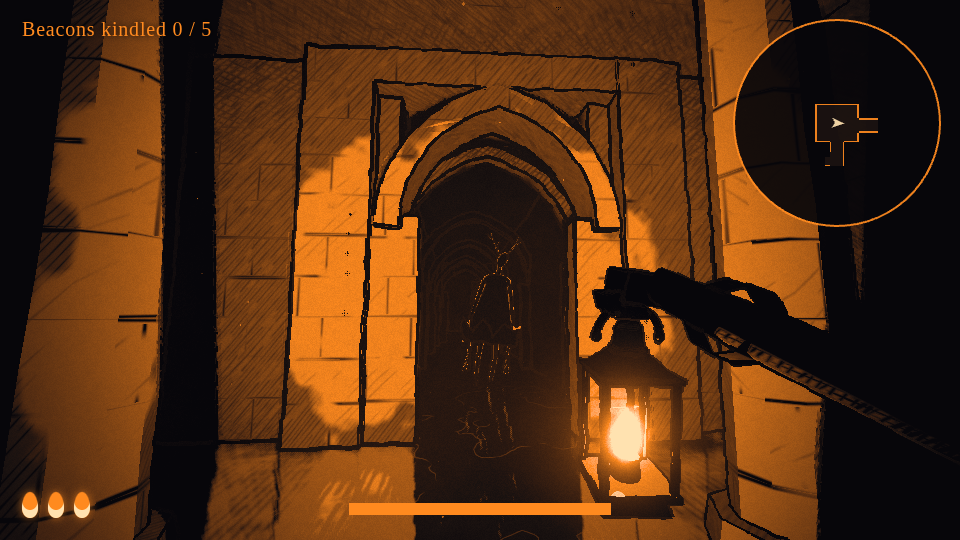
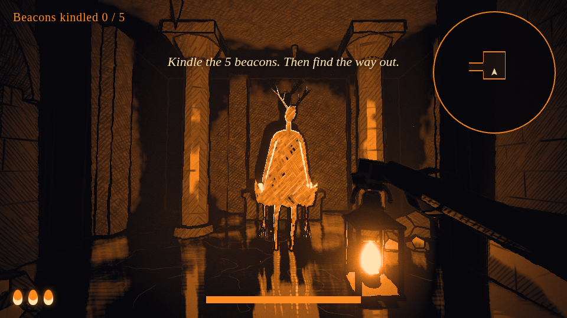
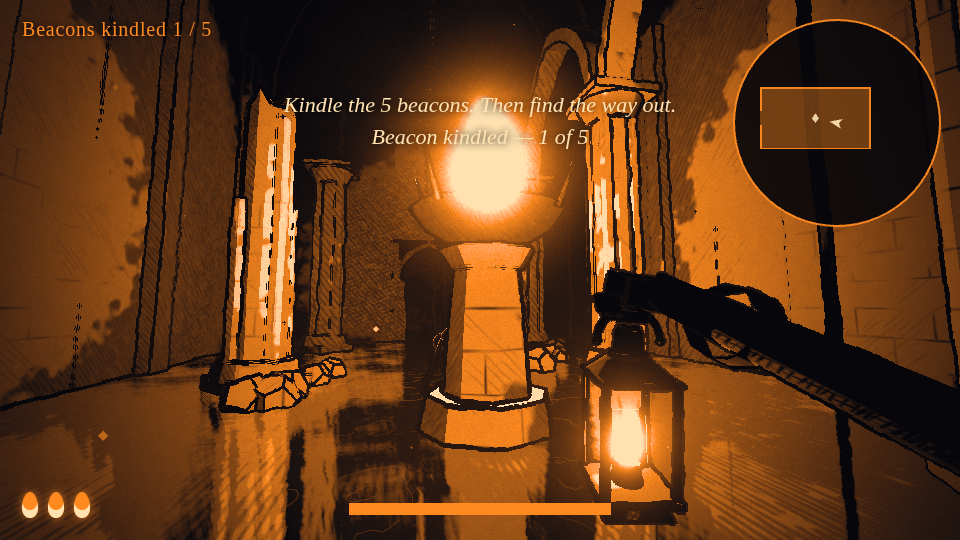
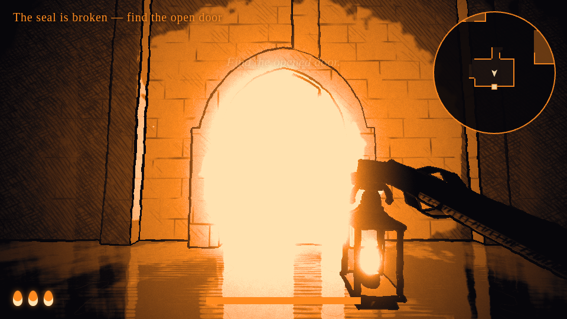
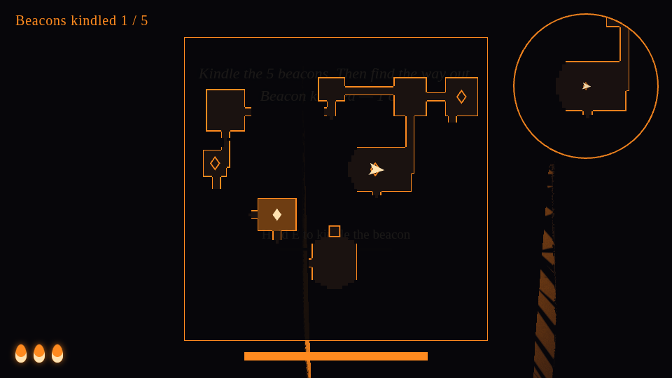

# Lanternkeeper — "Ink and Ember"

A first-person descent through drowned, procedurally built undercrofts, lit only by the lantern in
your hand and rendered like a woodcut print.

In the town above, people walk into the flood in their sleep. Your master went down after them and
never came back; his lantern did. Last night your brother walked into the water. Take the lantern down.

**Each depth:** kindle the dead beacons (each wakes a piece of the story), gather spilled oil, and when
the last beacon catches the great wooden door unbars. Find it (your flame leans toward it), read what
was left behind it, and descend through the well.



| | |
|---|---|
|  |  |
|  |  |

## Run

Requires Node 18+.

```bash
npm install
npm run dev          # http://localhost:5173
# or a production build:
npm run build && npm run preview
```

Use a desktop browser with WebGL2 (Chrome, Edge, Firefox, Safari 16+). The renderer also needs the
`EXT_color_buffer_float` extension, which nearly every desktop GPU provides.

## Controls

| Input | Action |
|-------|--------|
| **W A S D** / arrows | Wade |
| **Shift** | Hurry |
| Mouse | Look |
| **Left click** / **F** | Shutter the lantern: focused beam ⟷ wide glow |
| **E** (hold) | Kindle a beacon · gather oil · open the great door · read · descend · pick up a thrown lantern |
| **Right click** (hold) | Star blast *(learned at depth 2)* |
| **Space** (mash) | Pump oil into a burnt-out lantern |
| **Q** (hold, release) | Firebomb *(learned at depth 3)* |
| **M** (hold) | Full map |
| Esc | Release the mouse |

## How it plays

* **The shrine** (the start screen) is between depths. It shows your oil, the depths you can enter
  and the upgrade shop. Each new depth charges a **toll in oil**. Cleared depths are free, and every
  depth always has the same layout, so you can go back and gather oil.
* **Oil is the only resource.** Find spilled oil by its faint ember rings and hold **E** to scoop it.
  That takes both hands, so the lantern goes to your belt and the dark closes in. **Dying loses the
  oil you gathered on that descent**; escaping carries it home.
* **Beam:** the wide glow slows shadows. The focused beam holds them still and engraves fire into
  them; at full charge they **freeze for 5 s**.
* **Star blast** *(depth 2)*: the lantern swings to the centre, turns its star plate forward, and your
  open palm drives a five-pointed jet of fire through it, about **2 s** from a full meter. It burns
  everything in front of you, frozen shadows fastest. Run it dry and the wick gutters: mash **Space**.
* **Firebomb** *(depth 3)*: costs 6 oil. Douse the lantern, draw back with an arc guide, throw. It
  bursts into a pool of burning oil that lights the room and burns shadows. The iron lantern
  survives, but you're in the dark until you walk into the fire and take it back.
* **Beacons** make their room permanently lit and safe, restore a lost flame, and wake a piece of the
  story: a **mural** surfacing from the stone, an **echo** of shadow keepers replaying a moment, or a
  **dead keeper** with a journal page.
* **Shadows:**
  * *stalkers* and *hounds* hunt along the ground.
  * *Moths* (depth 3) ignore the beam's grip and are **drawn to it**, and to burning oil.
  * *Ceiling crawlers* (depth 4) cling to vaults; watch for drips. They drop when you pass beneath.
* **Upgrades** cost oil: blast heat, reach and breath; beam reach and grip; firebomb radius.

## URL parameters

| Param | Example | Effect |
|-------|---------|--------|
| `round` | `?round=2&free=1` | Jump straight into a depth (`free=1` skips the toll; for testing) |
| `quality` | `?quality=Low` | Low preset (lower resolution, cheaper shadows/fog) |
| `dev` | `?dev=1` | Look-dev panel (every style slider, copy JSON) + FPS counter |
| `cam` / `focus` / `play` / `overlay` | `?cam=0,-0.22,0,0,0&play=1&overlay=0` | Testing / screenshots |

The style is locked to the defaults in `src/core/Settings.js` (look-dev panel behind `?dev=1`).
Gameplay numbers live in `src/core/GameConfig.js`, depths, tolls, monster mixes and upgrade prices
in `src/data/rounds.js`, and all story text in **`src/data/story.js`**. Progress is saved in the
browser; "forget everything" on the shrine screen resets it.

## Documents

* [`STYLE_GUIDE.md`](STYLE_GUIDE.md): the rules of the look (palette, bands, hatching, outlines, water, creatures).
* [`ARCHITECTURE.md`](ARCHITECTURE.md): module layout, the render pipeline pass by pass, extension points
  for gameplay, performance notes, and the review log of issues found and fixed while building each layer.

## Tech summary

Three.js r186 on WebGL2 with custom `ShaderMaterial`s throughout, plus a hand-rolled post pipeline:
cube-map distance shadows from the flame → planar water reflection → MRT main pass (HDR colour +
normal/light G-buffer + depth) → half-res raymarched volumetric light → flame-only dual-Kawase bloom →
composite (ink outlines, fog, bloom, paper/grain/vignette, 4-colour palette ramp).
All geometry, textures and audio are procedural; there are no asset files.
