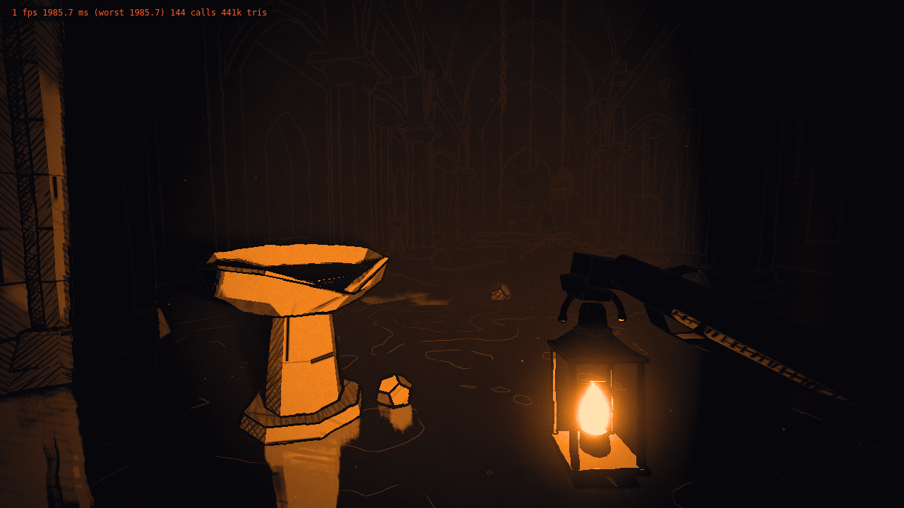
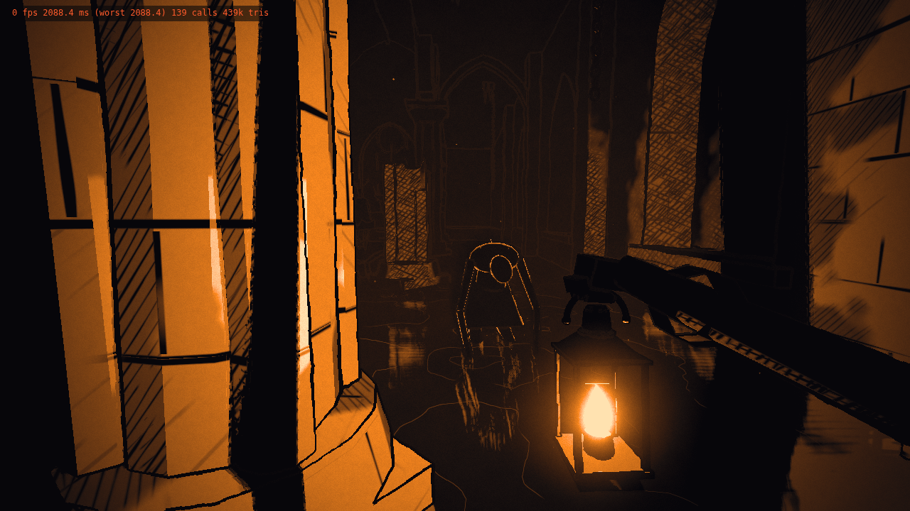
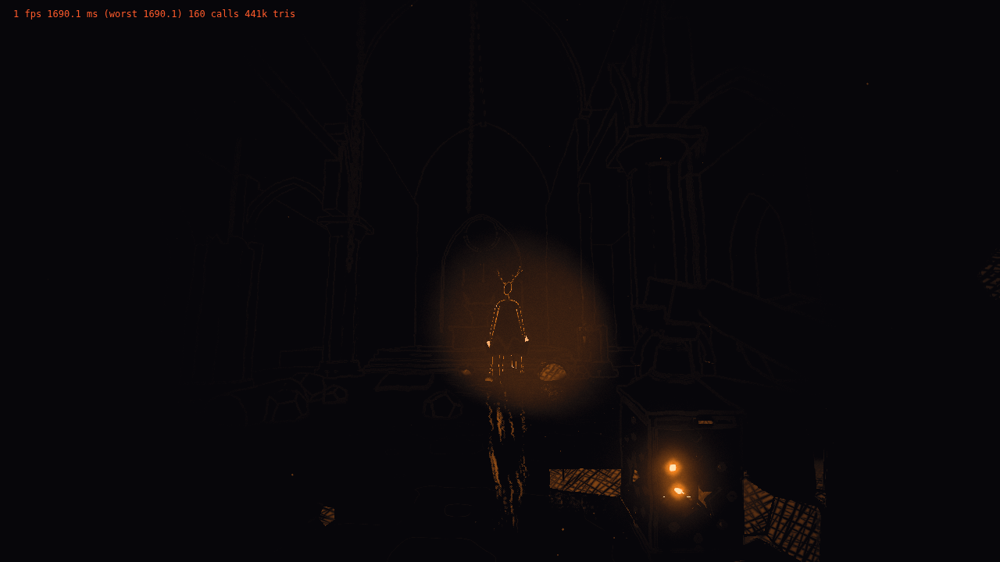
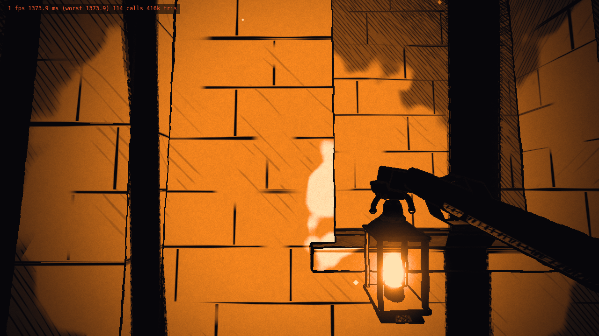
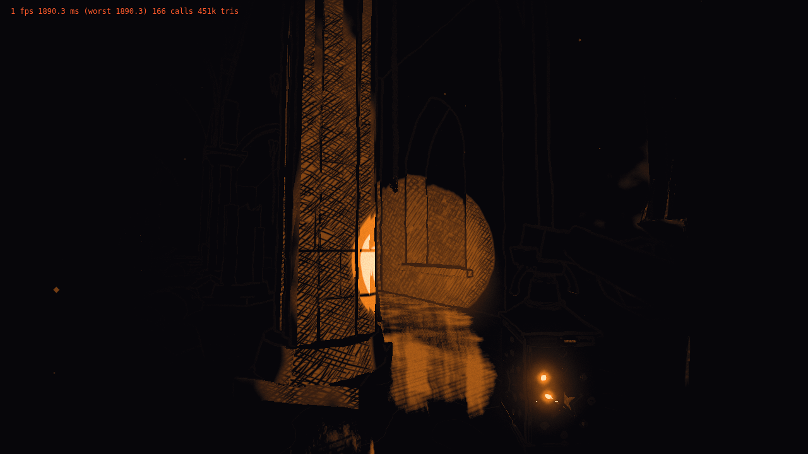

# Lanternkeeper — "Ink and Ember" style prototype

A first-person walk through a drowned cathedral, lit by the lantern in your hand
and rendered like a woodcut print. This phase is about **visual identity only**: no gameplay yet,
but the code is structured so gameplay systems can be added later.



| | |
|---|---|
|  |  |
|  |  |

## Run

Requires Node 18+.

```bash
npm install
npm run dev          # http://localhost:5173
# or a production build:
npm run build && npm run preview
```

Use a desktop browser with WebGL2 (Chrome, Edge, Firefox, Safari 16+). The renderer also needs the
`EXT_color_buffer_float` extension, which nearly every desktop GPU provides.

## Controls

| Input | Action |
|-------|--------|
| Click | Take up the lantern (pointer lock + audio start) |
| **W A S D** / arrows | Wade |
| **Shift** | Hurry |
| Mouse | Look |
| **Click** / **F** | Shutter the lantern: focused beam ⟷ wide glow |
| **H** | Hide/show the look-dev panel |
| Esc | Release the mouse |

## Look-dev panel

Every style parameter is live: palette, band thresholds, hatch density, thickness, wobble and angles,
outline width, wobble and boil, water, fog, bloom, grain, paper, vignette, flame flicker, creature rim,
player feel and audio mix. **Quality** switches High/Low at runtime. **View** shows debug buffers
(raw colour, normals, light bands, fog, outlines, NaN check).
**📋 Copy settings as JSON** puts the current look on the clipboard; paste it into `DEFAULTS` in
`src/core/Settings.js` to make it the new baseline.

### URL parameters (handy for comparisons and screenshots)

| Param | Example | Effect |
|-------|---------|--------|
| `quality` | `?quality=Low` | Start in the Low preset |
| `cam` | `?cam=1.2,-0.22,-9,0,8` | Spawn at feet x,y,z with yaw°, pitch° |
| `focus` | `&focus=1` | Start with the beam focused |
| `settings` | `&settings=<base64 JSON>` | Load a settings snapshot |
| `gui` / `overlay` | `&gui=0&overlay=0` | Hide panel / title card |

## Documents

* [`STYLE_GUIDE.md`](STYLE_GUIDE.md): the rules of the look (palette, bands, hatching, outlines, water, creatures).
* [`ARCHITECTURE.md`](ARCHITECTURE.md): module layout, the render pipeline pass by pass, extension points
  for gameplay, performance notes, and the review log of issues found and fixed while building each layer.

## Tech summary

Three.js r186 on WebGL2 with custom `ShaderMaterial`s throughout, plus a hand-rolled post pipeline:
cube-map distance shadows from the flame → planar water reflection → MRT main pass (HDR colour +
normal/light G-buffer + depth) → half-res raymarched volumetric light → flame-only dual-Kawase bloom →
composite (ink outlines, fog, bloom, paper/grain/vignette, 4-colour palette ramp).
All geometry, textures and audio are procedural; there are no asset files.
